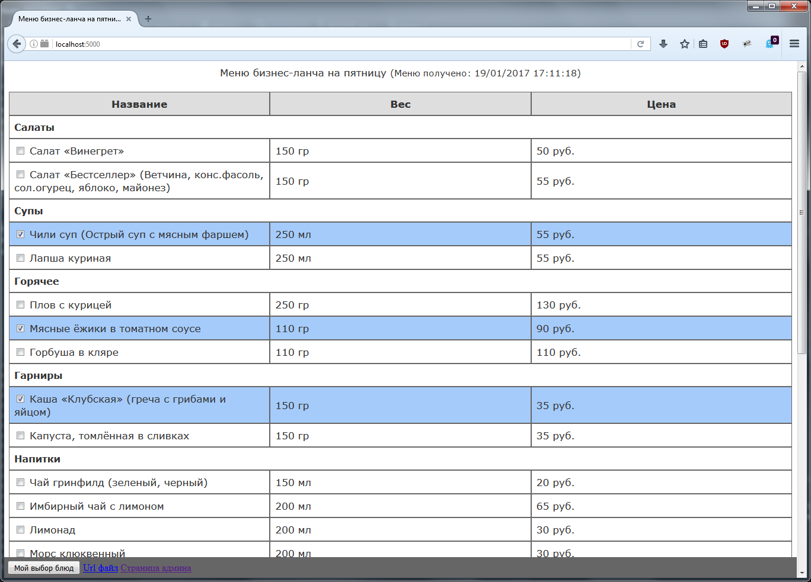
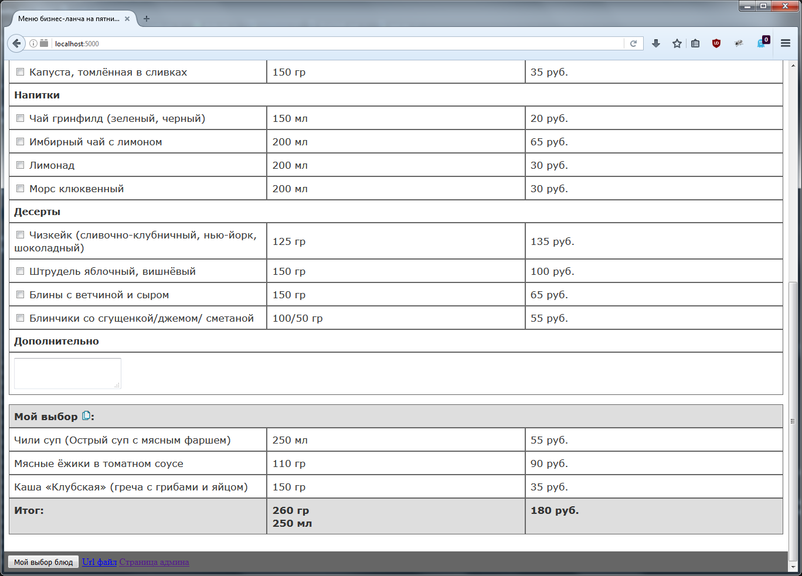
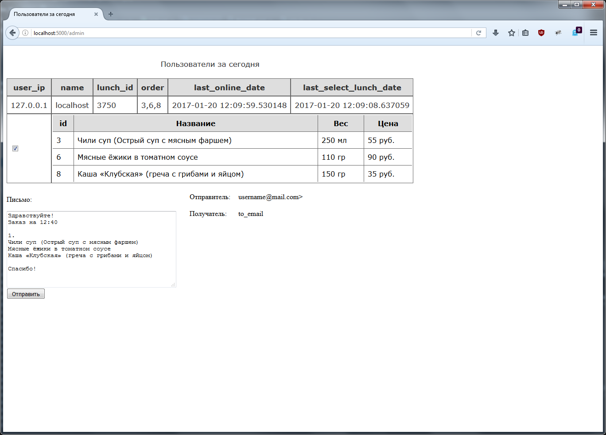

# ordering_lunch_at_Nashe_Vse

## Вебсервис для помощи заказа бизнес-обедов в один ресторан рядом с работой (#python3 #flask #email #word #sqlite #sqlalchemy)

Общий принцип работы:

Скрипт авторизуется под пользователем (username и password) на указанном smtp сервере (smtp_server).
После ищет письма за неделю от "Наше все" (from_email) и берет последнее письмо. У последнего письма
берет id и ищет в базе его. Если такого id нет, запрашивает письмо у smtp сервера, вытаскивает
его приложенный файл (docx) и сохраняет его. В docx-файле описана таблица с меню, которую скрипт парсит
и найденные в меню блюда добавляет в базу. После удаляет docx-файл.

Когда кто-то загружает страницу index, скрипт проверяет его по ip в базе, чтобы узнать есть ли
у этого пользователя выбранные id блюд и генерирует html страницу с списком блюд. Выбранные пользователем
блюда выделены цветом в таблице, плюс для них генерируется "Итого", в котором описаны выбранные блюда, и
общий вес и цена.

Для "Итого" предусмотрена кнопка сохранения названий блюд в буфер обмена.

##

